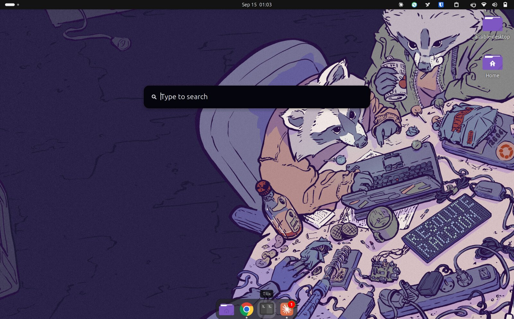
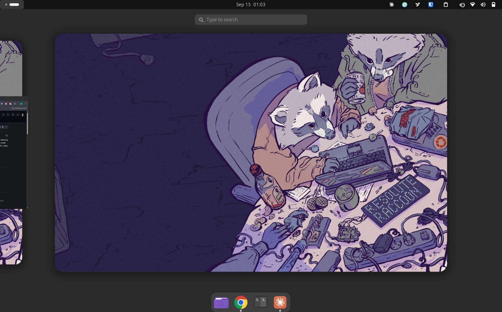
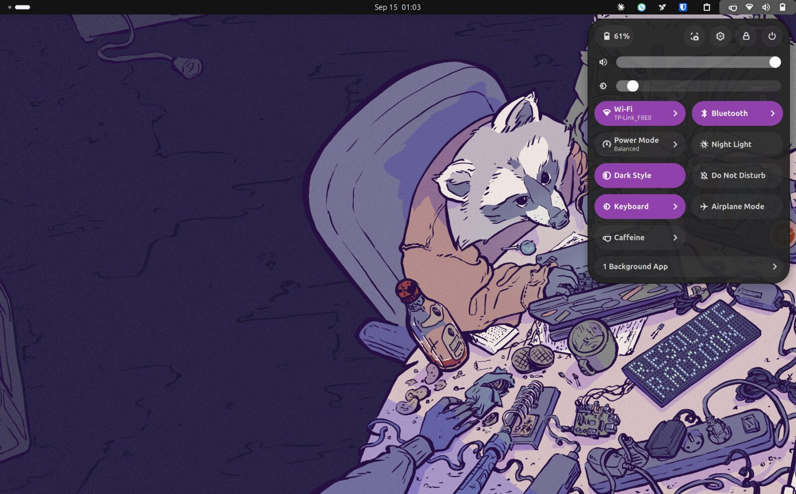
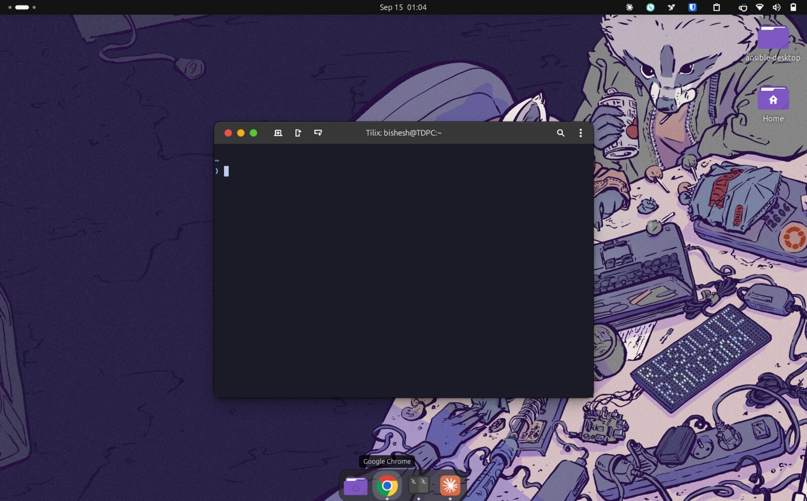

# My desktop, as code

Ansible playbook that turns a fresh **Debian 12/13** or **Ubuntu 22.04+** GNOME install into my
customised desktop: Mac-style keyboard, theme, dock, terminal, shell, and the apps I use.
Captured from my Debian 13 / GNOME 48 machine and re-verified on Ubuntu 26.04 / GNOME 50; every part
is idempotent, so re-running it only changes what drifted.

## What it looks like

| | |
|---|---|
|  |  |
| Super+Space (Cmd+Space on the Mac-style layout): Search Light, Spotlight-style, over the desktop | Activities overview with the WhiteSur shell theme and Dash to Dock |
|  |  |
| Quick settings: dark style, purple accent, Caffeine toggle | Tilix with Mac-style window buttons, JetBrainsMono Nerd Font and the Starship prompt |

## Quick start

```bash
sudo apt install -y git
git clone https://github.com/bishesh910/ansible-desktop.git ~/ansible-desktop
cd ~/ansible-desktop
./bootstrap.sh
```

`bootstrap.sh` installs Ansible if needed, asks for your sudo password once, and applies everything.
Run it **from a terminal inside the GNOME session** of the user being set up (dconf, `flatpak --user`
and `gnome-extensions` need the session D-Bus). After the first run, **log out and back in** so the
new GNOME extensions load, then run it once more so their settings apply.

## What it sets up

| Area | What |
|---|---|
| keyd | Mac-style modifiers on a PC keyboard: Alt key = Cmd (acts as Ctrl, Cmd+Q = close window, Cmd+Space = Search Light, Cmd+Tab = app switcher…), Windows key = Option (hold-Shift + Mac symbols + word navigation), Ctrl+Cmd+Q = lock screen. `files/keyd/default.conf`. Built from source where the distro has no package |
| GNOME | `us+mac` keyboard layout, dark mode, purple accent, Tela-purple-dark icons, WhiteSur-Dark-purple GTK + shell theme (also for libadwaita apps via `~/.config/gtk-4.0`), WhiteSur cursors, window buttons (close/min/max), touchpad speed, idle/lock delays, Ctrl+Shift+S screenshot, Ctrl+Shift+B opens Chrome |
| Extensions | Dash to Dock (bottom, auto-hides, dots, no Apps button, 48 px icons), Search Light (Super+Space, Spotlight-style: blurred, rounded, no panel icon), Clipboard Indicator, Caffeine, User Themes, AppIndicator, plus the Extension Manager app. The right build for the running GNOME version is fetched from extensions.gnome.org, except Search Light, which is built from a pinned GitHub commit with `files/search-light/pr164-hide-reentrancy.patch` (the extensions.gnome.org build stops at GNOME 49 and the unpatched GitHub one aborts GNOME Shell after login). IBus is told not to grab Super+Space. Do not click Install/Update on Search Light in Extension Manager: it reinstalls the old build |
| Tilix (default) + GNOME Terminal | Mac-style shortcuts (Cmd+T/N/F/G/comma, Ctrl+Tab / Ctrl+Shift+Tab for tabs, Cmd+1-9, Cmd+C/V, Cmd+Shift+W close tab, Cmd+Shift+R rename tab), dark, JetBrainsMono Nerd Font 11, Tokyo Night. Tilix keeps a renamed tab's name even when a remote SSH prompt sends its own title |
| Shell | readline word-delete on Option+Backspace/Delete, Starship prompt + config, `title NAME` to name a tab, `subl` helper, `~/.local/bin` on PATH |
| Apps | VS Code (Microsoft repo), Google Chrome, Sublime Text, Bitwarden (Flathub, user install), Telegram Desktop (official tarball in `~/.local/opt/Telegram`, self-updating), claude-desktop, tmux, htop, remmina |
| Remote access | Tailscale (`tailscaled` running), Teleport `tsh` client, NetBird service + tray UI, each from its vendor apt repo with the signing key shipped in `files/apt-keyrings/`. Log in to each once afterwards (`sudo tailscale up`, `tsh login`, the NetBird tray) |
| Autostart | NetBird tray, Remmina applet, Bitwarden |
| Dock | favourites: Files, Firefox, Chrome, Tilix, claude-desktop, Telegram |

Not included on purpose: the JumpCloud agent (enrolment-specific) and the Dash2Dock Animated extension,
which crashed GNOME Shell whenever an app quit.

Two favourites are Debian-specific: `firefox-esr.desktop` (Ubuntu's Firefox is a snap with a different id) and the
Telegram launcher id, which Telegram derives from its install path (`~/.local/opt/Telegram`), so it matches only
when the user name is the same. Fix the list in `files/dconf/shell.ini` if the dock shows a gap.

## Keyboard cheat sheet

`keyd` turns the key next to Space (physically Alt) into **Cmd** and the Windows key into **Option**. Ctrl stays
Ctrl, so Ctrl+C still interrupts in a terminal. Cmd otherwise behaves like Ctrl, so Cmd+S, Cmd+Z, Cmd+F and
friends work in every app; the table lists the deliberate exceptions.

| Keys | Does |
|---|---|
| Cmd+Space | Search Light launcher |
| Cmd+Tab (keep tapping Tab, or Left/Right) | app switcher; Cmd+` cycles windows of the same app |
| Cmd+Q / Cmd+H / Cmd+M | close window / minimise / minimise |
| Cmd+C / Cmd+V / Cmd+X | copy / paste / cut, also inside terminals (sent as Ctrl+Insert, Shift+Insert, Shift+Delete) |
| Cmd+Left / Right, Cmd+Up / Down | line start / end, document start / end (add Shift to select) |
| Cmd+[ / Cmd+] | back / forward; Cmd+Shift+[ / ] previous / next tab |
| Cmd+1 … Cmd+9 | switch to tab N |
| Cmd+Shift+3 / 4 / 5, Ctrl+Shift+S | GNOME screenshot UI |
| Ctrl+Shift+B | open Chrome |
| Ctrl+Cmd+Q | lock screen |
| Option+letter / digit | Mac symbols from the `us+mac` layout (Option+8 = •, Option+e e = é, Option+Shift+- = —) |
| Option+Left / Right, Option+Backspace / Delete | word navigation and word delete, in the shell too |
| Option+drag | selects text in a terminal that grabs the mouse (Option holds Shift) |

Terminal extras (Tilix and GNOME Terminal): Cmd+T / Cmd+N new tab / window, Cmd+Shift+W close tab,
Cmd+Shift+R rename tab, Ctrl+Tab / Ctrl+Shift+Tab next / previous tab, Cmd+comma preferences.

## After the first run

1. Log out and back in: GNOME only loads freshly installed extensions at login.
2. Run `./bootstrap.sh` once more so the extension settings (dock, Search Light…) are applied to schemas that
   now exist.
3. Log in to the things that need an account: `sudo tailscale up`, `tsh login`, the NetBird tray icon, Bitwarden.
4. Press Super+Space. If nothing appears, see below.

## Troubleshooting

- **Super+Space does nothing.** Check Extension Manager: Search Light should show as version 101 or newer with no
  red "out of date" badge. A badge means the extensions.gnome.org build (v42, GNOME ≤ 49) got installed over the
  GitHub one, usually by clicking Install or Update in Extension Manager. Re-run `./bootstrap.sh --tags user`
  and log out and in. Also make sure IBus is not holding the shortcut:
  `gsettings get org.freedesktop.ibus.general.hotkey triggers` must print `@as []`.
- **GNOME Shell restarts to the login screen a few seconds after logging in.** That was unpatched Search Light
  on GNOME 50 (a re-entrant hide() while the desktop-icons extension goes fullscreen; Clutter aborts the shell).
  The playbook applies `files/search-light/pr164-hide-reentrancy.patch` to avoid it; if the crash returns after
  bumping `search_light_commit`, check whether upstream merged the fix and drop or refresh the patch.
- **`./install.sh` of WhiteSur exits silently.** It needs `TERM` set (it drives a cursor animation with `setterm`).
  The playbook passes `TERM=xterm`; do the same when running it by hand.
- **The desktop looks dead after Cmd+Q.** Older versions of the keyd config let Ctrl+Alt+F4 through, which
  switches to virtual terminal 4. Ctrl+Alt+F2 (or F1) brings the GNOME session back; the current config maps
  Ctrl+Cmd+Q to lock instead.
- **Ansible hangs on the sudo prompt (Ubuntu 25.10+).** See the sudo-rs note under *Debian vs Ubuntu*.

## Updating pieces

- **Search Light:** bump `search_light_commit` in `group_vars/all.yml`; the build task reinstalls only when the
  result differs. Check that the patch still applies (`patch -p1 --dry-run` in a clone) before committing.
- **Any GNOME setting:** change it in the GUI, re-dump its dconf path into `files/dconf/` (see *Everyday use*),
  commit. The load task writes only when a key in the file differs, so runtime keys apps add are left alone.
- **Theme accent or variant:** change the `-t purple` / `-c Dark` flags in the two WhiteSur tasks and the theme
  name in `files/dconf/interface.ini` and `files/dconf/ext-user-theme.ini`, then delete `~/.themes/WhiteSur-*`
  so the build task runs again.

## Debian vs Ubuntu

The same playbook runs on both. Differences it handles by itself:

- Packages a release does not ship are skipped with a note (for example `xdg-terminal-exec` on older Ubuntu).
- `keyd` is installed from apt where packaged (Debian 13, Ubuntu 24.04+) and built from source otherwise (Ubuntu 22.04).
- GNOME Shell extensions are downloaded for the detected Shell version (50, 48, 46, 42…); Search Light always comes from GitHub.
- The default terminal is set both the new way (`~/.config/xdg-terminals.list`) and the old way
  (`x-terminal-emulator` alternative + `org.gnome.desktop.default-applications.terminal`), so Ctrl+Alt+T and
  "Open in Terminal" pick Tilix on either.
- On Ubuntu, the stock dock is replaced by Dash to Dock (same settings), while Ubuntu's desktop icons and tiling
  assistant stay enabled.
- Ubuntu 25.10+ makes `sudo-rs` the default `sudo`. It rewrites the password prompt Ansible passes with `-p`, so
  `--ask-become-pass` never matches it and the run fails with *"Timed out waiting for become success or become
  password prompt"*. `bootstrap.sh` detects this and points Ansible at classic sudo (`/usr/bin/sudo.ws`), which
  Debian and older Ubuntu use anyway. Running `ansible-playbook` by hand on such a release needs the same flag:
  `-e ansible_become_exe=/usr/bin/sudo.ws`.

## Layout

```
bootstrap.sh          install Ansible + run the playbook
playbook.yml          two plays: system (sudo) and user; tags `system` / `user`
group_vars/all.yml    everything tunable: package lists, versions, toggles, dconf map
files/keyd/           keyd config
files/dconf/*.ini     dconf dumps, loaded per path (edit these to change settings)
files/home/           dotfiles copied verbatim
files/apt-keyrings/   signing keys for the vendor apt repos
files/search-light/   patches applied on top of the pinned Search Light commit
docs/screenshots/     the images above
```

## Everyday use

```bash
./bootstrap.sh                          # apply everything
./bootstrap.sh --tags user              # only the $HOME half, no sudo needed
./bootstrap.sh --check --diff           # dry run: show what would change
```

To capture settings after tweaking something in a GUI, re-dump that path and commit:

```bash
dconf dump /com/gexperts/Tilix/ > files/dconf/tilix.ini      # one line per path in group_vars
```

`~/.bashrc` additions live between `# BEGIN/END ANSIBLE MANAGED` markers; edit them in `playbook.yml`, not in the file.
